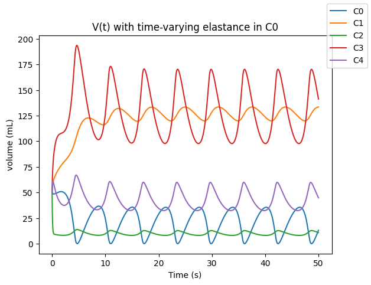

# A Unified Framework for Modeling Diffusive and Convective Transport of a Single Molecule Using Lumped Parameter Models

## General Overview
These files allow for the easy and modular construction of lumped parameter models of the circulator system to be synthesized in Python so that mass conservation equations can be solved to model bulk fluid flow and solute transfer over time. The computational framework allows users to specify models as a series of linked units which each represent a single lumped parameter unit in the circulatory system without having to hardcode differential equations. 

For example, we need only a few lines of code to specify a five-unit LPM model with one unit having a time-varying PV relationship:

```
from lpm_circ import *

# Time varying capacitance function
def cfunc(vol, t):
    return vol/(2*np.sin(t) + 2)

# Synthesize model; each unit addition requires one line of code
model = LPModel()
model.add_unit(LPunit(0, 8, C=2, links=[[4],[1]], ics=50))
model.add_unit(LPunit(1, 0.5, C=9, links=[[0],[2]], ics=50))
model.add_unit(LPunit(2, 0.27, C=0.7, links=[[1],[3, 4]], ics=50))
model.add_unit(LPunit(3, 0.25, C=9, links=[[2],[0]], ics=50))
model.add_unit(LPunit(4, 0.5, C=3, links=[[2],[0]], ics=50))

# Assign nonlinear PV relationship
model.units[0].assign_nonlinear("C", cfunc)
```

Constructed models can then be solved using the `solve_model()` method that is built into the class definition of `LPModel`, accepts an input time vector (in seconds), and outputs a series of volumes and solute numbers (which are obtained by using SciPy's `odeint()` function in the `integrate` module):

```
# Define a time vector
dt = .0001
T = 50

# Solution called for in one line of code
solution = model.solve_model(dt, T)
```

The user can then generate plots that demonstrate results, or feed the numerical solution into other methods.



## General Overview of BBB Modeling
The code corresponding to the modeling of transport across the blood-brain barrier is contained in the `lpm_test.ipynb` file. The last two execution blocks of of this Jupyter Notebook Conduct the required calculations to show transport, automatically set to show 50s-700s. If the model of nicotine is wished to be changed, it can be adjusted with inputs as mentioned above. The execution of the preceeding code blocks are required to make this model successful.

## Files in this package
* `lpm_circ.py`: functions and class definitions associated with the lumped parameter model
* `diff_circ.py`: functions associated with diffusion in different regions of the body
* `lpm_test.ipynb`: interactive Python notebook that demonstrates functionality

## Encoding LPM Units

In this framework, we use a traditional 3-parameter Windkessel model to represent each segment of the circulation. In each unit, we track volume and number of solute molecules, from which we can calculate pressure (via PV relationships) and concentration (from the definition of concentration).
